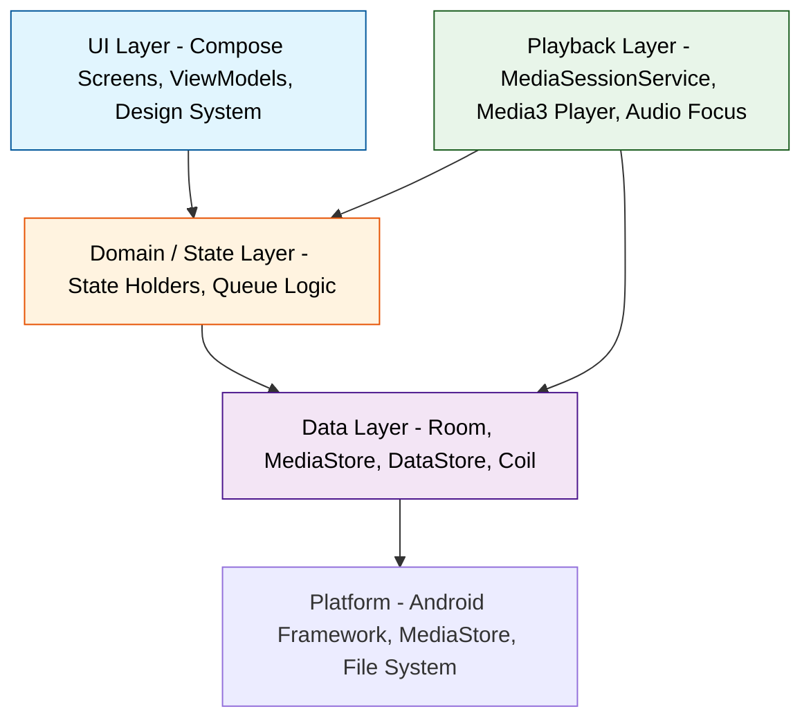

# Kaon Music - Initial Architectural Analysis

This response establishes the foundation before any code is generated. The goal is to separate what Kaon must be on day one from what it might become, and to define the smallest architecture that can support that reality without creating premature complexity.

## 1. Analysis of Vision and Requirements

### Core Product Thesis

Kaon is correctly framed as a local-first, user-owned music environment. That thesis creates a clear hierarchy of value:

1.  **Playback reliability** is non-negotiable. If playback fails, nothing else matters.
2.  **Library correctness** is the second core promise. The user must trust that what Kaon shows matches what is on device.
3.  **Performance and resource discipline** is a product feature, not an optimization task, especially for modest hardware.
4.  **UI, metadata enrichment, artwork, and personalization** exist to make the core experience better, not to replace it.

This hierarchy should directly drive architectural priority. Most architectural risk comes from inverting this hierarchy - for example, building a sophisticated theming or recommendation system before playback and library sync are solid.

### What the Vision Gets Right

*   Explicit commitment to a single source of truth for playback
*   Emphasis on incremental development over big-bang architecture
*   Recognition that concepts like plugins, kernels, and recommendation engines are possibilities, not requirements
*   Strong constraints around performance, battery, and maintainability

### Immediate Architectural Implication

Kaon is not a content streaming app, not a social app, and not a general media platform. It is a **local media library + reliable playback engine + Compose UI** application. The architecture should reflect that narrow scope.

## 2. Contradictions, Ambiguities, and Architectural Risks

| Area | Contradiction / Ambiguity | Risk if Unresolved |
| :--- | :--- | :--- |
| **Customization vs Maintainability** | Vision wants "deeply customizable" UI including themes, layouts, player designs, and possibly runtime plugins, while also requiring long-term maintainability by a single developer. | Building a general plugin/theming engine too early will create a framework-maintenance burden that consumes all development time. Customization without clear limits leads to tight coupling between UI variants and core logic. |
| **Metadata Normalized vs Raw** | Requirement to keep raw tags distinguishable from normalized model, but no definition of normalization rules or identity. | Without a defined identity strategy, normalization becomes ad-hoc and migrations become expensive. Risk of duplicate artists/albums that can never be merged cleanly. |
| **Queue Authority** | States queue is a system-level concern and wants to avoid competing sources of truth with Media3, but also wants persistence, shuffle, repeat, and reorder. | Two queue implementations will inevitably diverge - one in Media3 `Timeline`, one in Room/DataStore. Conflicts on process death or configuration change cause lost queues or playback restarts. |
| **Library Sync Strategy** | Wants large library support without repeated full scans, but no defined detection mechanism. | MediaStore behavior differs across OEMs and Android versions. Assuming `ContentObserver` is sufficient will miss renames, SD card changes, and bulk operations. Full scan fallback is expensive. |
| **Recommendation Vision vs Data** | Wants library-connected recommendations but first version should not be sophisticated. | If history/personalization schema is over-designed for future ML, it will be unused and costly to migrate. If under-designed, you cannot evolve to useful recommendations without rewrites. |
| **Navigation 3 + Player UI** | Wants Navigation 3, adaptive layouts, mini-player, and full player. | Navigation 3 is still new and its interaction with persistent UI like a mini-player and bottom sheets is not standardized. Custom navigation infrastructure could be built to work around immaturity. |
| **"Extensible" Language** | Vision uses words like modular, extensible, plugin. Clarification says not every idea should become abstraction. | Team may still interpret every future idea as needing an abstraction now. This is the highest architectural risk for a solo developer - speculative abstractions. |
| **Artwork as Subsystem** | Artwork must be efficient and never break playback/library, but potential sources are not fixed. | If artwork loading is coupled to Room entities or playback, a failure or slow decode will block scrolling or playback preparation. |

**Highest Risks Ranked:**

1.  **Dual playback state machines** - Kaon state vs Media3 state diverging.
2.  **Library identity and sync** - Incorrect identity choice makes future deduplication and move/rename handling impossible.
3.  **Premature modularization / plugin system** - Creates coupling and build complexity without benefit.

## 3. Actual Requirements vs Assumptions vs Long-Term Ideas

This separation determines what the initial architecture must support.

### A. Actual Requirements for V1 (Must Influence Day-One Architecture)

These are required for a usable, releasable player:

*   MediaStore discovery for tracks (albums, artists derived from tracks)
*   Room database as cache/index, not as primary source
*   Media3/ExoPlayer + MediaSessionService for background playback
*   Audio focus, becoming-noisy, headset/Bluetooth controls, notification
*   Queue with play, play next, remove, reorder, clear, shuffle, repeat
*   Single authoritative playback state exposed to UI
*   Artwork from embedded tags via Coil with memory/disk cache
*   Basic library screens: tracks, albums, artists, folders
*   Jetpack Compose + Material 3 + adaptive layout
*   Light/dark theme

### B. Assumptions That Must Be Validated (Do Not Hard-Code Yet)

*   Navigation 3 is the right choice over Navigation Compose. Assumption: Navigation 3's benefits for adaptive layouts outweigh its relative immaturity.
*   Hilt is necessary. Assumption: Manual dependency provision would be more complex, but for a single-module app Hilt adds KSP overhead and build time.
*   Ktor is needed. Assumption: If V1 is fully offline, networking is not needed yet.
*   WorkManager is needed for library sync. Assumption: A foreground service or simple coroutines in the app process may be sufficient for initial scan.

### C. Long-Term Ideas That Must NOT Drive V1 Structure

These ideas should be noted but not abstracted for:

*   Runtime plugin system (themes, UI modules, metadata providers, recommendation engines as plugins)
*   Online services for metadata/artwork/lyrics/discovery
*   Streaming sources (should not influence the `Track` model now)
*   Sophisticated recommendation engine / ML
*   Full-text search engine (Room `LIKE` / FTS is deferred until proven insufficient)
*   User-correctable metadata and metadata enrichment pipelines
*   General-purpose dynamic UI customization beyond design tokens

> Principle: If a feature does not have a concrete V1 requirement and a concrete data model, it should not create an interface, module, or table now.

## 4. Decisions That Matter Now vs Decisions to Leave Open

| Decision | Status | Rationale |
| :--- | :--- | :--- |
| **Playback state ownership** | Decide Now | Fundamental to everything. Must define what belongs to Media3 vs Kaon before writing any player code. |
| **Library identity strategy** | Decide Now (minimal version) | Affects primary keys and sync. Cannot be changed cheaply later. |
| **Module structure** | Decide Now | Determines build complexity for the next 6-12 months. |
| **Database entities for V1** | Decide Now (minimal) | Tracks, albums, artists only. No history/favorites schema until needed. |
| **Package boundaries and dependency direction** | Decide Now | Low-cost discipline that prevents future entanglement. |
| **Navigation choice** | Decide Now, but reversible | Choose one and isolate it behind a thin wrapper so it can be replaced. |
| **Queue persistence strategy** | Decide Now (minimal) | Decide what must survive process death to avoid data loss bugs. |
| **Plugin system** | Leave Open | No concrete requirement. Revisit when a second implementation for same contract exists. |
| **Recommendation algorithm** | Leave Open | Build history collection first, algorithm later. |
| **Search implementation** | Leave Open | Start with simple Room queries. Measure before introducing FTS. |
| **Online service topology** | Leave Open | Do not create generic `MetadataProvider` unless an actual provider is integrated. |
| **Advanced customization** | Leave Open | Implement design-token theming only. Defer layout/plugin customization. |
| **Streaming model** | Leave Open | Do not make `Track` polymorphic for streaming now. |

## 5. Smallest Sensible Architectural Foundation

The proposed foundation is intentionally conservative. It optimizes for clarity, testability, and incremental delivery by a single developer.

### Foundation Principles

1.  **Single Gradle module with strict package boundaries.** The overhead of multi-module builds is not justified until there is a proven need for independent build, test, or ownership boundaries.
2.  **Explicit layered dependency direction.** UI depends on domain/state, which depends on data. Data never depends on UI. Playback service is an isolated entry point that shares only state and repository contracts.
3.  **One authoritative playback state.** Media3's `Player` inside `MediaSessionService` is the source of truth. Kaon observes it and adds persistence/queue logic around it, but never duplicates its state machine.
4.  **Room as a derived cache.** MediaStore is the source of truth for file existence. Room is a queryable index for performance. Sync logic is the only writer.
5.  **No use-case classes by default.** Logic lives in ViewModels or repositories until duplication or testability forces extraction. A use case exists only when it protects a real boundary or is reused.

### Logical Layers (Not Gradle Modules)



**Dependency Rule:** Arrows point inward toward stability. `UI` may depend on `DOMAIN` and `DATA` contracts, but `DATA` must never import `UI`. `PLAYBACK` is not allowed to import `UI`.

## 6. Major Boundaries and Dependency Direction

| Boundary | Owner | What It Protects | Allowed Direction |
| :--- | :--- | :--- | :--- |
| **UI - ViewModel - Repository** | ViewModel | Keeps database and MediaStore work off the main thread and off Composables. Provides lifecycle-aware `StateFlow` to UI. | ViewModel -> Repository. Composable -> ViewModel only (no direct repository access). |
| **Playback Service Boundary** | `MediaSessionService` | Isolates ExoPlayer lifecycle, audio focus, and notification from UI lifecycle. | Service -> Repositories (read-only for queue/persistence). UI -> Service only via `MediaController`. No direct `Player` access from UI. |
| **Library Sync Boundary** | Sync Coordinator (single class, not a framework) | Centralizes all writes to Room. Prevents concurrent scans and UI-triggered writes from racing. | Only Sync Coordinator writes to `Track/Album/Artist` tables. UI and Playback only read. |
| **Artwork Boundary** | Coil + Repository | Ensures decoding, resizing, and caching never run on main thread and never crash callers. | UI requests `artworkKey`; repository returns cached or placeholder. No direct file decoding in UI. |
| **Database Boundary** | Room DAOs | Source of truth for queries, but not for file existence. | DAOs are interfaces owned by Data layer. Domain depends on DAO interfaces, not Room impl directly (though in single module this is a package-level rule). |

**Sources of Truth Defined:**

*   **File existence:** MediaStore
*   **Query performance / UI list:** Room
*   **Playback state (position, playing, queue order):** Media3 `Player`
*   **User preferences (shuffle, repeat mode):** DataStore (persisted), mirrored to `Player`
*   **Queue persistence across process death:** Room/DataStore (restored *into* Media3 on startup, not kept in parallel)

## 7. Proposed Initial Repository / Module Structure

**Recommendation: One Gradle module (`:app`) with enforced package boundaries.**

This is cheaper, faster to build, and easier to refactor than premature multi-module separation. Enforce boundaries with lint rules or `package-private` visibility rather than Gradle.

```
app/src/main/java/com/kaonmusic/
├── ui/
│   ├── theme/              # Design tokens, typography, color schemes, spacing
│   ├── components/         # Reusable Compose components (no business logic)
│   ├── navigation/         # Thin wrapper around Navigation 3 (isolated)
│   └── screens/            # Tracks, Albums, Artists, Search, Player (each has ViewModel + Screen)
├── playback/
│   ├── service/            # MediaSessionService, MediaSession, AudioFocus handler
│   ├── queue/              # Queue operations that translate to Media3 Timeline operations
│   └── state/              # Single PlaybackState model observed by UI via MediaController
├── data/
│   ├── db/                 # Room database, entities, DAOs (tracks, albums, artists)
│   ├── mediastore/         # MediaStore discovery, ContentObserver, sync coordinator
│   ├── artwork/            # Coil loaders, cache keys, resizing logic
│   └── preferences/        # DataStore for settings
└── di/                     # Hilt modules (if Hilt is retained)

app/src/main/java/com/kaonmusic/core/  # Optional: pure Kotlin models that have zero Android dependencies
├── model/                  # Track, Album, Artist (normalized, UI-agnostic)
└── result/                 # Shared Result/Error types
```

**Why not multi-module now:**

| Approach | Benefit | Cost for Solo Dev |
| :--- | :--- | :--- |
| **Single module + packages** | Fastest build, simplest navigation, easiest refactoring, lowest cognitive load | Requires discipline to not bypass boundaries |
| **Small multi-module (e.g., :core, :data, :playback, :ui)** | Enforced separation, parallel builds, clearer ownership | 20-40% slower clean builds, added Gradle complexity, premature API surface stabilization, frequent cross-module changes |
| **Large modular (feature modules)** | Scalability for large teams | Massive overhead, not justified for V1 scope |

Start with the first row. Split into modules only when a package has a genuinely independent reason to be separate - for example, if `playback` needs to be tested or built independently from `ui`, or if build times exceed tolerance.

## 8. First Architectural Decisions to Settle Before Implementation

These should be discussed and recorded using the decision format before any feature code is written:

**Decision 1: Playback State Model**
*   What fields are owned by Media3 (`isPlaying`, `currentPosition`, `playbackState`, `Timeline`)? What fields are owned by Kaon (`shuffleMode`, `repeatMode`, `queuePersistence`)? How does UI observe state - directly via `MediaController` or through a Kaon `PlaybackStateFlow` that maps `Player` events?

**Decision 2: Library Identity**
*   V1 Recommendation: Use `MediaStore.Audio.Media._ID` + `MediaStore.Audio.Media.DATA` (path) + `DATE_MODIFIED` as composite identity for tracks. Do not use hashes or audio fingerprints in V1. Normalized `Album` and `Artist` are derived by grouping tracks on `ALBUM_ID`/`ARTIST` strings, not separate discovery. This is simple and survives renames poorly, but is sufficient for V1 if sync handles `ContentObserver` correctly. Document that renames will be treated as remove+add in V1.

**Decision 3: Library Synchronization**
*   Choose: Hybrid strategy - `ContentObserver` for incremental updates while app is in foreground + `WorkManager` periodic `ContentResolver` diff on startup + full scan only on first install or on explicit user action. Define recovery for interrupted scans (transactional Room inserts, last-sync timestamp in DataStore).

**Decision 4: Queue Persistence**
*   Decide: Persist queue as list of `mediaId` + current index + position in DataStore/Room. On service restart, restore into `Player.setMediaItems()`. Resolve conflict by letting persisted queue win only if `Player` has empty timeline; otherwise `Player` wins to avoid overwriting user intent.

**Decision 5: Database Schema V1 (Minimal)**
*   Tables: `tracks`, `albums`, `artists` only. No `play_history`, `favorites`, `playlists` in V1 schema. Keep migration path clean. Use foreign keys from `tracks` to `albums`/`artists` via stable IDs, not names.

**Decision 6: Navigation Isolation**
*   Wrap Navigation 3 calls behind a `Navigator` interface owned by `ui/navigation`. This isolates the choice and allows fallback to Navigation Compose without touching screens.

**Decision 7: Dependency Injection**
*   Challenge Hilt: For single module, consider `manual Hilt` vs `Hilt` vs `Koin` trade-off on build time and simplicity. If Hilt is kept, justify it with a concrete benefit (e.g., ViewModel injection + Service injection). Decision should weigh build time on modest hardware.

## 9. Parts of Long-Term Vision That Must NOT Influence Initial Architecture

Explicitly exclude these from V1 design to prevent speculative abstraction:

*   **Runtime plugin system** - No dynamic feature loading, no plugin registry, no extension points for themes or metadata providers. Use ordinary interfaces and Hilt bindings if a second implementation appears.
*   **Streaming as polymorphic media** - Do not make `Track` an interface with `LocalTrack` and `StreamingTrack`. V1 `Track` is a local file only. Streaming later becomes a separate subsystem that may share only `PlaybackState`.
*   **Sophisticated recommendation engine** - No ML, no similarity graph. If history is collected at all in V1, it is a simple append-only log, not a training dataset.
*   **Online service framework** - No generic `MetadataProvider` abstraction, no rate-limiting or auth infrastructure. If external artwork is added, it is a single implementation behind the artwork boundary.
*   **Full-text search engine** - No dedicated search index. Room queries with `LIKE` are sufficient for V1 library sizes.
*   **Advanced dynamic UI customization** - Beyond light/dark theme and design tokens, do not build layout editors, player-style switchers, or runtime Compose generation.
*   **User-corrected metadata as source of truth** - Keep V1 metadata read-only from MediaStore. Corrections imply a conflict resolution strategy that is not needed yet.
*   **Cross-platform or web architecture** - Android-only. No shared KMP modules or web considerations.

Any code that anticipates these ideas in V1 should be challenged as premature.

---

### Next Step

If you agree with this direction, the next incremental step is to record Decisions 1-7 in a lightweight Architecture Decision Record (ADR) format and then define the minimal V1 database schema and playback state model before creating any Gradle modules or Compose screens.

Do you want to start with **Playback State Model (Decision 1)** and **Library Identity (Decision 2)**, as those two constrain all other work, or would you prefer to settle **Module Structure and DI choice** first?
